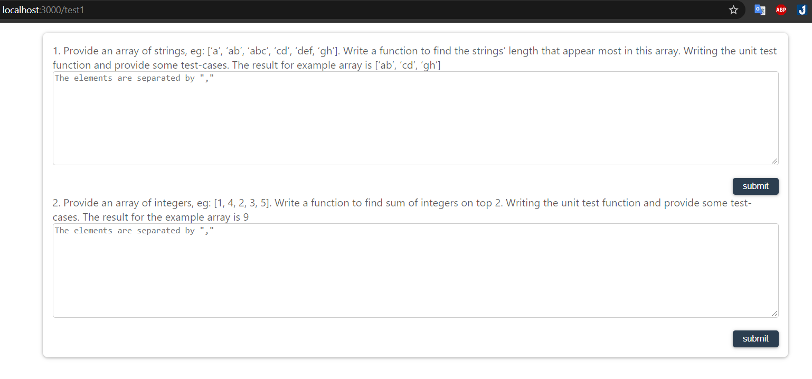

# seta-test-s

# Requirements

I. Javascript algorithm

1. Provide an array of strings, eg: [‘a’, ‘ab’, ‘abc’, ‘cd’, ‘def, ‘gh’]. Write a function to find the strings’ length that appear most in this array. Writing the unit test function and provide some test-cases. The result for example array is [‘ab’, ‘cd’, ‘gh’]
2. Provide an array of integers, eg: [1, 4, 2, 3, 5]. Write a function to find sum of integers on top 2. Writing the unit test function and provide some test-cases. The result for the example array is 9
   II. React
3. Provide the API for posts: https://jsonplaceholder.typicode.com/posts
   Writing a react-redux app that:
   Get and display posts from API
   Have a PostForm component to add new post

```sh
npm i
```

```sh
cd seta-test
npm i
```

# Javascript algorithm

```sh
path: /test1
```

## 1. Javascript algorithm

</img>

# ReactJS

```sh
path: /
```

## 1. Get and display posts from API

</img>

## 2. Have a PostForm component to add new post

</img>
